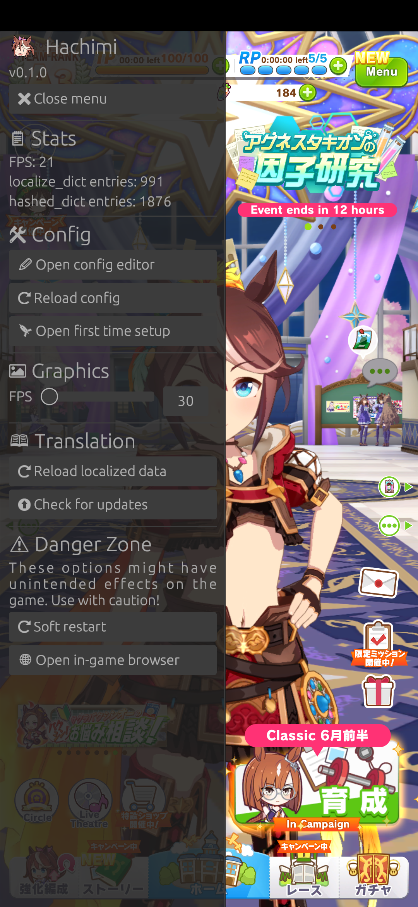

# Hachimi

Game enhancement and translation mod for UM:PD.

# Features
- **High quality translations:** Hachimi comes with advanced translation features that help translations feel more natural (plural forms, ordinal numbers, etc.) and prevent introducing jank to the UI. It also supports translating most in-game components; no manual assets patching needed!

    Supported components:
    - UI text
    - master.mdb (skill name, skill desc, etc.)
    - Race story
    - Main story/Home dialog
    - Lyrics
    - Texture replacement
    - Sprite atlas replacement

    Additionally, Hachimi does not provide translation features for only a single language; it has been designed to be fully configurable for any language.

- **Easy setup:** Just plug and play. All setup is done within the game itself, no external application needed.
- **Translation auto update:** Built-in translation updater lets you play the game as normal while it updates, and reloads it in-game when it's done, no restart needed!
- **Built-in GUI:** Comes with a config editor so you can modify settings without even exiting the game!
- **Graphics settings:** You can increase the game's graphics to make full use of your device's specs.
- **Cross-platform:** Designed from the ground up to be portable, with first class Android support.

### Planned features
- Windows support
- Translation tools

# Installation
## Android
### UmaPatcher
The easiest way to install is by using [UmaPatcher](https://github.com/LeadRDRK/UmaPatcher) which will modify the APK, install and configure everything for you.

### Manually
1. Build or download the prebuilt libraries from the [Releases page](https://github.com/Hachimi-Hachimi/Hachimi/releases).
2. Extract the APK file of the game. You might want to use [apktool](https://apktool.org/) for this.
3. Rename the `libmain.so` file in each of the folders inside `lib` to `libmain_orig.so`.
4. Copy the proxy libraries to their corresponding folders (e.g. `libmain-arm64-v8a.so` goes to `lib/arm64-v8a`). Rename them to `libmain.so`.
5. Build the APK file and install it.

# Configuration
Configuration can be done within the game itself using the built-in config editor, or you can also edit the config file directly:
- Android: `/sdcard/Android/media/jp.co.cygames.umamusume/hachimi/config.json`

# Special thanks
These projects have been the basis for Hachimi's development; without them, Hachimi would never have existed in its current form:

- [Trainers' Legend G](https://github.com/MinamiChiwa/Trainers-Legend-G)
- [umamusume-localify-android](https://github.com/Kimjio/umamusume-localify-android)
- [umamusume-localify](https://github.com/GEEKiDoS/umamusume-localify)
- [Carotenify](https://github.com/KevinVG207/Uma-Carotenify)
- [umamusu-translate](https://github.com/noccu/umamusu-translate)
- [frida-il2cpp-bridge](https://github.com/vfsfitvnm/frida-il2cpp-bridge)

# License
[GNU GPLv3](LICENSE)
